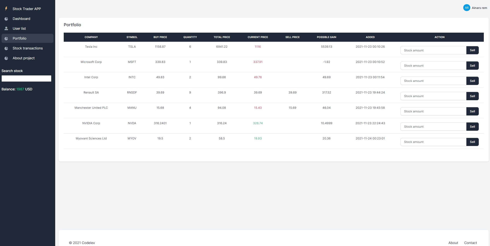

This project is made using Laravel v8 and MySql 5.7.35/PHP v7.4 to show https://finnhub.io/ data and do virtual actions with stocks.

To get it working, follow these steps:

1. Fork this repo
2. in projects root folder rename ".env.example" to ".env" and fill these lines:

   DB_DATABASE=

   DB_USERNAME=

   DB_PASSWORD=

   FINNHUB_API_KEY= (register in finnhub.io and get your API key)

3. make empty databse (charset:"utf8mb4", collation: "utf8mb4_unicode_ci") with the name what entered in "DB_DATABASE=",

4. open in consele projects directory and use these two commands to install dependencies:
   npm install
   composer install
5. run:

   php artisan migrate

6. to check status of migrations

   php artisan migrate:status

7. run server with command

   php artisan serve

